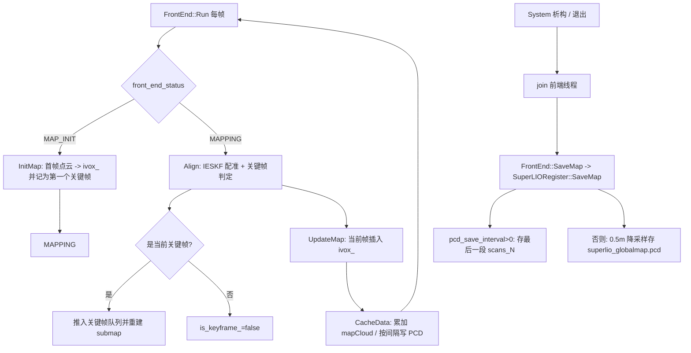

# SuperLIO 关键帧与地图保存逻辑总结

> 适用范围：`src/lio_slam/src/lidar_register/superlio_register.{cc,hh}`
> 前端调度：`src/lio_slam/src/frontend/front_end.cc`
> 保存触发：`src/lio_slam/src/system/system.cc`（析构时）
> 相关配置：各 `config/*.yaml` 的 `front_end` 段（如 `config/livox.yaml`）

---

## 1. 总体框架

`SuperLIORegister` 继承自 `LidarRegister`，由 `front_end.cc` 依据
`use_superlio: true`（见 `config/livox.yaml`）在 `FrontEnd` 构造函数中创建
（`front_end.cc` ~L60）。

前端线程 `FrontEnd::Run()` 的建图状态机为：

```
IMU_INIT ──> MAP_INIT ──> MAPPING ──> LOST(可重初始化)
             (首帧 InitMap)  (每帧 Align)
```

每帧在 `MAPPING` 状态下的处理顺序（`front_end.cc`）：

1. `Align(undistort_cloud_lidar_, kf_ptr_)` —— 配准 + 判断关键帧
2. `UpdateMap()` —— 把当前帧点云插入体素地图 `ivox_`
3. `GetSubmap()` —— 取关键帧拼接的 submap（LOCALIZATION 模式给定位器用）
4. `IsKeyFrame()` —— 关键帧时向 localizer 下发 submap
5. `CacheData()` —— 每帧都把当前帧累加进待保存的 `mapCloud`

最终整张地图的保存发生在**程序退出时**：`System::~System()`
（`system.cc`）先 `join()` 前端线程，再调 `FrontEnd::SaveMap()` →
`lidar_register_ptr_->SaveMap()`。



---

## 2. 相关配置项（`config/*.yaml` 的 `front_end` 段）

| 参数 | 含义 | livox.yaml 默认值 |
|---|---|---|
| `use_superlio`（顶层） | 是否启用 SuperLIO 配准器 | `true` |
| `keyframe_size` | 关键帧队列容量（超过则丢弃最旧的） | `15` |
| `keyframe_distance` | 关键帧触发阈值（见 §3，为 ‖Δθ‖+‖Δt‖ 的**和**） | `0.5` |
| `keyframe_angle_distance` | 使用角度关键帧时的纯旋转阈值（rad） | `0.5` |
| `use_angle_keyframe` | 是否启用“纯旋转也触发关键帧” | `true` |
| `save_map` | 是否保存地图 | `true` |
| `pcd_save_interval` | 分块 PCD 保存间隔；`-1` 表示不按块存，退出时统一存全局地图 | `-1` |
| `map_dir` | 地图输出目录 | `/home/li/ros2_ws` |

对应代码：`SuperLIORegister` 构造函数（`superlio_register.cc` L16-L23）从
`system_config_->frontend_config_` 读取；YAML 解析在 `system_config.cc` L94-L100。

---

## 3. 关键帧判定与 submap 构建（`Align`）

`Align()`（`superlio_register.cc` L90 起）是核心：

```cpp
voxel_grid_fliter_(0.2m)  -> current_lidar_      // 0.2m 体素降采样
is_keyframe_ = false;
kf_ptr_->UpdateLidar();                           // ESKF 迭代,内部回调 UpdateLidarFunc 做点面残差
curr_pose = PoseTrans(rot, pos);
T_WL = curr_pose * lidar2imu_;                    // 雷达位姿
if (keyframes_.size() > keyframe_size_) keyframes_.pop_front();  // 限制队列长度
delta_pose = last_keypose_.inverse() * curr_pose;
if ( delta_pose.norm() > keyframe_distance_ ||
     (use_angle_keyframe_ && delta_pose.RPY().norm() > keyframe_angle_distance_) )
{
    is_keyframe_ = true;
    last_keypose_ = curr_pose;
    cloud_world_tmp = TransformLidarOMP(cloud_lidar, T_WL);   // 原帧点云转到 world
    keyframes_.push_back({T_WL, cloud_world_tmp});
    // 关键帧变化时才重建 submap：拼接队列里所有关键帧点云
    lock(local_map_mutex_);
    for (auto &kf : keyframes_) *tmp_submap += *kf.second;
    submap_ = tmp_submap;
}
```

要点：

- **判据是相对上一关键帧位姿 `last_keypose_` 的增量**，不是相对上一帧。
  注意 `PoseTrans::norm()`（`common/pose_trans.hh`）定义为
  `RPY().norm() + t.norm()`，即第一个条件比较的是
  **旋转角之和 + 平移量** 超过 `keyframe_distance_`；
  开启 `use_angle_keyframe_` 后，纯旋转 ‖Δθ‖ 超过
  `keyframe_angle_distance_` 也会触发。
- 触发关键帧后把**该帧原始（未降采样）点云**按 `T_WL` 转到 world 系，
  以 `{位姿, 点云}` 形式存入双端队列 `keyframes_`（基类成员，
  `lidar_register.hh`）。
- `keyframes_` 只保留最近 `keyframe_size_` 个关键帧，超限 `pop_front`。
- `submap_` 由队列内全部关键帧点云拼接而成，**只在新增关键帧时重建**，
  供 `GetSubmap()`/定位器使用（LOCALIZATION 模式下关键帧时下发）。
- 首帧（`InitMap`）会直接把首帧记为第一个关键帧并生成初始 submap。

> 说明：用于**配准/建图**的真正地图是体素地图 `ivox_`（见 §4），
> `submap_` 与 `keyframes_` 主要用于下发给定位器/对外发布，二者职责不同。

---

## 4. 体素地图 `ivox_` 的维护（配准用地图）

`ivox_` 是 `OctVoxMap`（八叉树体素），构造参数：叶子大小 `0.5m`、
容量 `1,000,000` 点（`superlio_register.cc` L11-L13），用于对每个点做
KNN(5) 近邻 → 平面拟合（`calc_plane_coeff`/`compute_error`），构造点面残差
（`UpdateLidarFunc`）驱动 IESKF 迭代。

| 时机 | 函数 | 行为 |
|---|---|---|
| 首帧 | `InitMap` | 用 `T_WL = T_WI * T_IL` 把首帧点云转到 world 并 `ivox_->insert`；`first_frame_=false`；记第一个关键帧 |
| 每帧 | `UpdateMap` | 将当前帧点云（`points_body` 已为 IMU/body 系）用当前状态 `R*t + t` 转到 world，`ivox_->insert(points_world)`，增量插入体素地图 |

> 体素地图 `ivox_` 本身没有落盘实现（`OctVoxMap::saveMap()` 是 TODO），
> 最终保存的是 §5 由 `CacheData` 累积出来的 `mapCloud`。

---

## 5. 地图落盘：`CacheData`（运行中累加/分块）+ `SaveMap`（退出时）

### 5.1 运行中 —— `CacheData()`（每帧调用）

```cpp
if (!save_map_) return;
current_pose = PoseTrans(state.rot, state.pos);
T_WL = current_pose * lidar2imu_;
cloud_world_tmp = TransformLidarOMP(current_lidar_, T_WL);  // 当前帧(world) 
if (!cloud_world_tmp->empty()) { *mapCloud += *cloud_world_tmp; scan_wait_num++; }

if (pcd_save_interval_ < 0) { scan_wait_num = 0; return; }   // 不分块:只累积

// 首次: rm -rf map_dir/PCD; mkdir -p map_dir/PCD
if (mapCloud->size()>0 && scan_wait_num >= pcd_save_interval_) {
    pcd_index_++;
    savePCDFileBinary(map_dir/PCD/scans_<pcd_index_>.pcd, *mapCloud);  // 二进制
    mapCloud->clear(); scan_wait_num = 0;
}
```

- 每帧都把 `current_lidar_`（0.2m 降采样后的当帧点云）转到 world，累加到
  `mapCloud`（`save_map_` 为真时在构造函数里才分配）。
- `pcd_save_interval_ < 0`（如 `-1`）→ **不写分块 PCD**，`mapCloud` 全程累积，
  留给退出时的全局地图。
- `pcd_save_interval_ > 0` → 每攒满 N 帧写一个 `PCD/scans_i.pcd`
  （每段内含最近 N 帧累积点云），随后清空 `mapCloud` 重新累积。

### 5.2 退出时 —— `SaveMap()`（System 析构触发）

```cpp
if (!save_map_) return;
if (pcd_save_interval_ > 0) {
    if (!mapCloud->empty()) {   // 收尾:把剩余部分写成最后一段 scans_i.pcd
        pcd_index_++;
        savePCDFileBinary(map_dir/PCD/scans_<pcd_index_>.pcd, *mapCloud);
        mapCloud->clear();
    }
    // ProcessCaceMap() 目前被注释,未做进一步合并
    return;
}
if (!mapCloud->empty()) {                       // pcd_save_interval_ <= 0
    map_name = map_dir_ + "/superlio_globalmap.pcd";
    voxel 0.5m 降采样 -> 设 width/height/is_dense;
    savePCDFileBinary(map_name, latst_map);     // 二进制整图
}
```

触发链路：程序退出（如 Ctrl+C / `rclcpp::shutdown` 后 `main` 结束）→
`map_node.cc` 中 `system_ptr` 析构 → `System::~System()`（`system.cc`）
先 `join()` 前端线程再 `FrontEnd::SaveMap()` → `SuperLIORegister::SaveMap()`。

---

## 6. 输出产物汇总

| 场景 | 输出文件 | 说明 |
|---|---|---|
| `pcd_save_interval_ = -1`（默认） | `<map_dir>/superlio_globalmap.pcd` | 退出时一次性保存，0.5m 降采样，二进制 |
| `pcd_save_interval_ > 0` | `<map_dir>/PCD/scans_0.pcd ... scans_N.pcd` | 运行中每 N 帧一块，退出时补最后一段；不产出 global map |
| 配准用地图 | 内存中 `ivox_` | 仅用于实时配准，不落盘 |
| 关键帧/submap | 内存中 `keyframes_` / `submap_` | 仅用于下发给 localizer / 发布，不落盘 |

---

## 7. 小结（一次典型建图生命周期）

1. `use_superlio: true` 创建 `SuperLIORegister`，读入关键帧与保存相关参数；
   `save_map: true` 时分配累积点云 `mapCloud`。
2. 首帧 `InitMap` 初始化 `ivox_` 并记为第 1 个关键帧。
3. 此后每帧：`Align`（IESKF 点面配准；相对上一关键帧位移/旋转超阈值则生成
   关键帧并重建 submap）→ `UpdateMap`（把当帧插入 `ivox_`）→ `CacheData`
   （当帧转入 world 累加到 `mapCloud`；若 `pcd_save_interval_>0` 则按块写 PCD）。
4. 退出时 `System` 析构 `join` 前端线程后调用 `SaveMap`：
   默认（`-1`）把全程累积的 `mapCloud` 做 0.5m 降采样写
   `<map_dir>/superlio_globalmap.pcd`。
